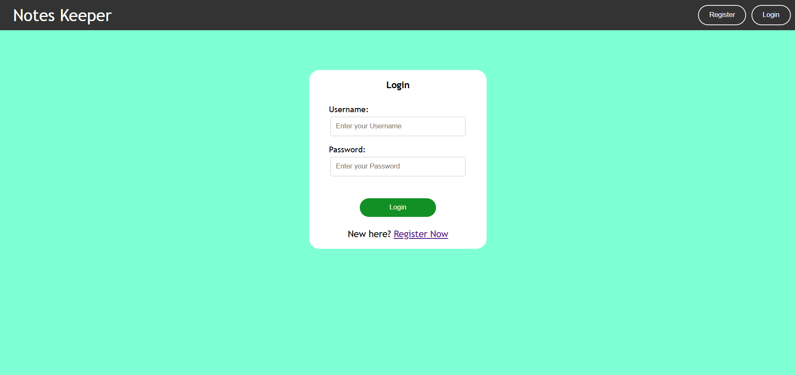
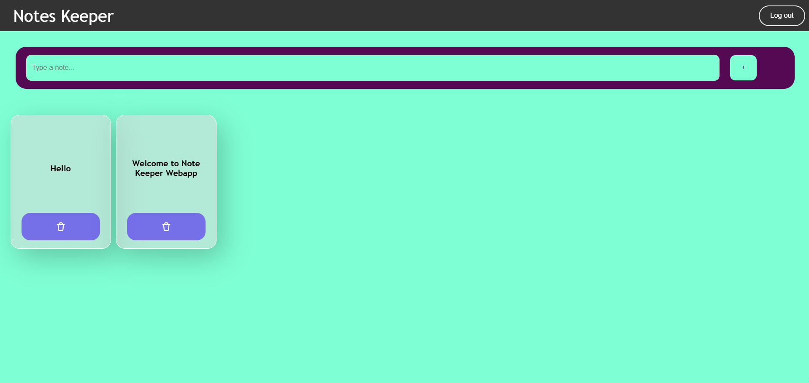

# Note Keeper

### Description:
"Note Keeper" is a web-based application designed to securely store and manage user notes. Built using Python (Flask) for the backend and HTML/CSS for the frontend, the app offers the following features:

- User Authentication: Users can register, log in, and securely manage their accounts.
- Notes Management: Create, view and delete notes.
- Secure Data Handling: Notes are encrypted before storage.

### Files:
1. **`app.py`:**
   The main Python file containing the Flask application and routes. Handles authentication, note creation, deletion, and serves the necessary templates and static files.

2. **`templates/`:**
   - **`login.html`:** Displays the login page where users can log in with their credentials.
   - **`register.html`:** The registration page for new users to sign up.
   - **`main.html`:** The main interface where users can add, view, and delete notes.

3. **`static/`:**
   - **`styles.css`:** The CSS file that styles the application, ensuring a visually appealing and responsive design.

4. **`requirements.txt`:**
   Contains a list of Python dependencies required to run the project. Install them using `pip install -r requirements.txt`.

## Screenshot



## Requirements
- Python 3.x
- Flask==3.0.0
- Flask-SQLAlchemy==3.0.5
- Werkzeug==3.0.1


## Install & Setup
1. Clone the repository.
```bash
    git clone https://github.com/Govind-Sankar/Note-Keeper-WebApp.git
    cd /Note-Keeper-WebApp/
```
2. Install dependencies using `pip install -r requirements.txt`.
3. Run the application with `python app.py`.
4. Open your web browser and navigate to `http://127.0.0.1:5000`.

## License
This project is open source and available under the [MIT License](https://opensource.org/licenses/MIT).